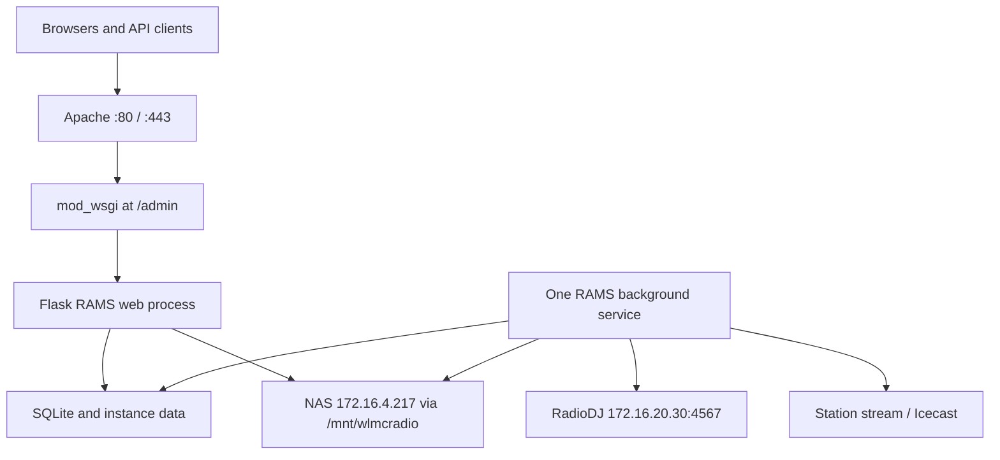

# RAMS Technical, Deployment, and Maintenance Guide

**System:** Radio Admin Management System (RAMS)

**Station:** WLMC Radio: The Finn

**Audience:** Landmark College IT, station technical staff, software maintainers, and advanced student administrators

**Current reference platform:** Ubuntu Server 24.04.4 LTS, Python 3.12, Apache HTTP Server, and `mod_wsgi`

**Last reviewed:** September 2026

This is the primary technical handoff document for RAMS. It covers the current
WLMC test environment, a clean installation, Apache/WSGI deployment, the
separate scheduler process, RadioDJ and NAS networking, Windows administration,
backups, upgrades, migrations, security, logs, and troubleshooting. The feature
descriptions and operational commands in this guide were checked against the
repository's current `main` branch.

Related documents:

- [Web and background-service deployment](wsgi_deployment.md)
- [RadioDJ REST API reference](radiodj_rest_api.md)
- [Permissions reference](permissions_reference.md)
- [OAuth setup](oauth_setup.md)
- [Feature overview](features_overview.md)

> [!IMPORTANT]
> Never place passwords, API keys, OAuth client secrets, NAS credentials,
> private SSH keys, or an unredacted `instance/user_config.json` in Git. Obtain
> server credentials from Landmark College IT through its approved process.

## 1. Known WLMC deployment facts

The following values are confirmed for the current test environment unless a
row explicitly says that IT must confirm it.

| Item | Test/current value | Production or migration note |
| --- | --- | --- |
| Test hostname | `wlmc-test.landmark.edu` | Replace with the destination hostname during migration. |
| Test server IPv4 address | `172.16.4.226` | Production server IP is not yet documented. |
| Operating system | Ubuntu Server 24.04.4 LTS | Use a currently supported Ubuntu LTS release and Python version compatible with `mod_wsgi`. |
| Python | 3.12 | The Apache `mod_wsgi` module must be compiled for the same Python major/minor version. |
| SSH/SFTP | TCP 22 | WinSCP uses SFTP over SSH. “SFTP-3” is the negotiated SFTP protocol version, not port 3. |
| Test URL | `http://wlmc-test.landmark.edu/admin/` | The test server does not currently provide HTTPS. Keep access on trusted networks. |
| Intended production URL | `https://wlmc.landmark.edu/admin/` | DNS name may later change to a station-owned custom domain. |
| URL mount point | `/admin` | Configure both Apache and RAMS consistently for this prefix. |
| Repository/runtime directory | `/opt/RadioAdminSystem` | This guide uses the same location for clean installs. |
| Apache configuration root | `/etc/apache2` | Active site file name is not yet documented; discover it before editing. |
| Apache access log | `/var/log/apache2/radioadmin_access.log` | Confirm the active virtual host actually declares this path. |
| Apache/WSGI error log | `/var/log/apache2/radioadmin_error.log` | Primary location for import errors and Python WSGI tracebacks. |
| RadioDJ computer | `172.16.20.30` | Windows News Booth computer; it must remain on a VLAN with routed access to the RAMS server. |
| RadioDJ REST port | TCP 4567 | Permit RAMS server `172.16.4.226` to initiate connections to `172.16.20.30:4567`. |
| RadioDJ REST binding | All required network interfaces | Do not expose TCP 4567 to the public Internet. |
| Synology NAS | `172.16.4.217` | Server-side mount point is `/mnt/wlmcradio`. |
| Music library | Existing folder below the mounted WLMC share | Preserve the current `NAS_MUSIC_ROOT` setting; do not assume the mount root is the music folder. |
| VLAN names/IDs and subnet masks | **IT must confirm** | The IP addresses prove the RAMS and RadioDJ hosts are in different numbered networks, but this guide does not invent the masks or VLAN IDs. |
| Apache/WSGI service identity | **Discover on the server** | Ubuntu commonly uses `www-data`; a fresh install in this guide uses a dedicated `rams` account. |
| Background systemd unit | **Not yet confirmed** | Restarting `apache2` does not prove that `background_service.py` is managed by systemd. |

Before changing an existing deployment, record all currently active values:

```bash
hostnamectl
ip -br address
ip route
python3.12 --version
sudo apache2ctl -S
sudo apache2ctl -M | grep -i wsgi
sudo systemctl status apache2 --no-pager
sudo findmnt --target /mnt/wlmcradio
sudo grep -R "wlmc-test\|radioadmin\|WSGIScriptAlias" /etc/apache2 2>/dev/null
```

## 2. What RAMS does

RAMS is a Flask application for radio-station administration and automation.
The current code includes:

- show and DJ scheduling;
- scheduled and marathon stream recordings;
- stream probing and classification as live audio, automation, or dead air;
- RadioDJ now-playing, state, playlist, rotation, category, track, and AutoDJ integration;
- DJ logs and PSA/live-read compliance reporting;
- recording review and export;
- news and community-calendar upload/rotation;
- a NAS-backed music library, metadata editor, audio preview, cover art, analysis,
  saved searches, playlists, and CUE markers;
- Icecast listener analytics and metadata updates;
- optional Barix InStreamer restart/self-heal behavior;
- Google and Discord OAuth plus a local emergency/master login;
- settings and selected-data backups;
- plugins for Automation Bridge, hosted audio, website content, and Remote
  Studio Link.

RAMS is not one continuously running Python process in production. It has two
runtime roles:

1. **Apache + `mod_wsgi` web application:** receives browser and API requests.
2. **One background service:** owns APScheduler and performs recordings, probes,
   polling, indexing, rotation, and maintenance work.



### 2.1 Critical process-ownership rule

Run exactly one scheduler owner for a live station. The production web workers
must not start APScheduler. The repository enforces this through `wsgi.py`, which
sets `RAMS_WSGI_SAFE_MODE=1` before importing the application. The scheduler is
started explicitly by `background_service.py`.

Do not run `python run.py` alongside the production background service.
`run.py` opts into scheduler startup because it is intended as a single-process
development entry point. Running both can create duplicate recordings, probes,
imports, and maintenance jobs.

The background service uses a file lock at
`instance/background-service.lock`. That lock prevents two copies on the same
server and instance directory. It does **not** prevent the old and new servers
from both running schedulers during a migration. Cutovers must explicitly stop
the old scheduler before starting the new one.

## 3. Responsibility boundaries

### Landmark College IT

- Assign and document server addresses, DNS, VLANs, routes, and ACLs.
- Issue or authorize SSH/SFTP accounts and keys.
- Maintain Ubuntu, Apache, firewall policy, TLS certificates, backups, and
  monitoring.
- Maintain the NAS export/mount and service-account access.
- Approve the News Booth VLAN and firewall rules for TCP 4567.
- Confirm which Linux account runs Apache's WSGI daemon and the RAMS background
  service.

### RAMS software maintainer

- Maintain source code, `requirements.txt`, database changes, tests, and this
  documentation.
- Stage and review updates before production.
- Run schema setup intentionally during a maintenance window.
- Protect `instance/user_config.json` and redact diagnostic material.
- Validate web, scheduler, RadioDJ, stream, and NAS behavior after releases.

### Station administrator/operator

- Manage RAMS users, shows, logs, news, recordings, and feature settings through
  the UI within granted permissions.
- Report failures with timestamps, URLs, actions taken, and screenshots.
- Avoid server, firewall, or file-permission changes unless authorized.

## 4. Repository and runtime layout

| Path | Purpose | Operational note |
| --- | --- | --- |
| `app/__init__.py` | Flask application factory | Loads configuration, logging, database, routes, OAuth, plugins, and optional startup actions. |
| `app/main_routes.py` | Major HTML/admin routes | Includes settings, shows, users, DJs, recordings, music, and operations pages. |
| `app/routes/api.py` | JSON/API routes | Authorization varies by endpoint; never assume every `/api` route is private. |
| `app/routes/auth.py` | Master login and OAuth | Uses sessions and user approval state. |
| `app/routes/logging_api.py` | DJ log workflow | Includes submission, viewing, and exports. |
| `app/routes/news.py` | News upload and rotation | Reads/writes configured NAS or output paths. |
| `app/services/` | Domain and integration services | RadioDJ, stream detection, health, alerts, library, backups, etc. |
| `app/plugins/` | Optional plugin blueprints | Plugins are discovered and registered during app creation. |
| `app/scheduler.py` | APScheduler jobs and recording orchestration | Must have only one production owner. |
| `config.py` | code defaults and environment-derived paths | Do not store real secrets here. |
| `wsgi.py` | Apache/mod_wsgi entry point | Exposes the callable named `application` and enables WSGI safe mode. |
| `background_service.py` | scheduler/service entry point | Run as one supervised service. |
| `run.py` | direct Flask entry point | Development or single-process testing only. |
| `scripts/db_setup.py` | explicit schema/migration command | Run during deployment rather than in WSGI workers. |
| `requirements.txt` | pinned Python dependencies | This is the authoritative install list. |
| `tests/` | pytest test suite | Install `pytest` separately in a staging/test environment. |
| `docs/` | technical and feature documentation | Keep this guide updated when architecture or deployment changes. |

### 4.1 Persistent files

The repository deliberately ignores most of `instance/`. On a default install
at `/opt/RadioAdminSystem`, important runtime paths are:

| Default path | Contents |
| --- | --- |
| `/opt/RadioAdminSystem/instance/user_config.json` | Site settings and secrets. |
| `/opt/RadioAdminSystem/instance/app.db` | Default SQLite database. |
| `/opt/RadioAdminSystem/instance/migrations/` | Locally generated Alembic migration state. |
| `/opt/RadioAdminSystem/instance/data/logs/ShowRecorder.log` | Default RAMS application/scheduler log. |
| `/opt/RadioAdminSystem/instance/data/recordings/` | Default recording output. |
| `/opt/RadioAdminSystem/instance/data/radiodj_imports/` | Default local RadioDJ handoff/staging directory. |
| `/opt/RadioAdminSystem/instance/settings_backups/` | Rotating copies of `user_config.json`. |
| `/opt/RadioAdminSystem/instance/data_backups/` | JSON snapshots of DJs, shows, and disciplinary records. |
| `/opt/RadioAdminSystem/instance/analytics/` | Listener analytics when enabled. |
| `/opt/RadioAdminSystem/instance/transcodes/` | Temporary transcoded media cache. |

The actual runtime log path is `LOGS_DIR/ShowRecorder.log`. Do not assume that a
`ShowRecorder.log` in the repository root is the active log. Confirm paths from
the running configuration or the Settings → Logs page.

> [!CAUTION]
> RAMS' built-in settings backup and data snapshot are useful, but they are not
> a complete disaster-recovery backup. The data snapshot contains selected
> tables, not the full SQLite database. Back up `app.db`, `user_config.json`,
> local recordings/data, Apache configuration, the systemd unit, and the NAS
> separately.

## 5. Python basics for maintainers

This section is intentionally introductory. A maintainer does not need to be a
Python expert, but must understand the following rules before editing production
code.

### 5.1 Files, modules, packages, and imports

- A `.py` file is a Python module.
- A directory such as `app/` containing `__init__.py` is a package.
- `from app import create_app` imports the `create_app` function from
  `app/__init__.py`.
- Imports execute top-level module code. An import error can therefore prevent
  the entire WSGI application from loading.
- The virtual environment isolates RAMS packages from Ubuntu's system Python.
  Always run RAMS commands with the virtual environment's Python executable.

### 5.2 Indentation and syntax

Python uses indentation to define blocks. Use four spaces for each level; do
not mix tabs and spaces.

```python
def status_message(stream_up: bool) -> str:
    if stream_up:
        return "Stream is available"
    return "Stream is unavailable"
```

The colon after `def` and `if` is required. The indented lines belong to those
blocks. Common mistakes include:

- missing a colon;
- mismatched `(`, `[`, or `{` characters;
- an unterminated quote;
- incorrect indentation;
- referring to a variable before it is assigned;
- importing a module that is not installed in the active virtual environment.

Python tracebacks should be read from the bottom upward. The last line names
the exception; the preceding lines identify the call path and file/line where
it occurred.

### 5.3 Virtual-environment commands

On Ubuntu:

```bash
cd /opt/RadioAdminSystem
source .venv/bin/activate
python --version
python -m pip --version
deactivate
```

Activation only changes the current shell. Systemd and Apache do not inherit an
interactive activation. Their configurations must point to the virtual
environment explicitly.

### 5.4 Flask application factory and WSGI callable

`create_app()` constructs a Flask application. `wsgi.py` calls it once and
exports the result as `application`, the conventional name expected by
`mod_wsgi`:

```python
import os
from app import create_app

os.environ.setdefault("RAMS_WSGI_SAFE_MODE", "1")
application = create_app()
```

Do not rename `application` without updating the WSGI configuration. Do not
start a development server from `wsgi.py`.

### 5.5 Safe checks before deployment

Run these from the repository using its virtual environment:

```bash
/opt/RadioAdminSystem/.venv/bin/python -m compileall -q \
  /opt/RadioAdminSystem/app \
  /opt/RadioAdminSystem/config.py \
  /opt/RadioAdminSystem/run.py \
  /opt/RadioAdminSystem/wsgi.py \
  /opt/RadioAdminSystem/background_service.py \
  /opt/RadioAdminSystem/scripts
```

For tests, use a staging environment and install pytest there:

```bash
sudo /opt/RadioAdminSystem/.venv/bin/python -m pip install pytest
cd /opt/RadioAdminSystem
RAMS_WSGI_SAFE_MODE=1 .venv/bin/python -m pytest -q
```

The `sudo` above assumes the fresh-install layout in this guide, where root owns
the virtual environment. If a staging maintainer owns its venv, install as that
owner instead. Do not make the production venv world-writable.

Do not experiment directly in `site-packages`, edit the active SQLite database
with a text editor, or test changes during a scheduled recording.

## 6. Software requirements

### 6.1 Ubuntu packages

For a fresh Ubuntu 24.04 server:

```bash
sudo apt update
sudo apt install --yes \
  apache2 \
  libapache2-mod-wsgi-py3 \
  apache2-dev \
  build-essential \
  git \
  python3.12 \
  python3.12-dev \
  python3.12-venv \
  python3-pip \
  ffmpeg \
  sqlite3 \
  curl \
  ca-certificates \
  cifs-utils \
  nfs-common \
  netcat-openbsd
```

Why these packages matter:

- Apache receives HTTP/HTTPS requests.
- `libapache2-mod-wsgi-py3` connects Apache to Python. `apache2-dev`, a compiler,
  and Python headers also allow the pinned `mod_wsgi` package in
  `requirements.txt` to build.
- FFmpeg is required for stream probing and recording; `ffmpeg-python` is only
  the Python wrapper and does not install the FFmpeg executable.
- `sqlite3` provides safe backup and inspection commands for the default DB.
- `cifs-utils` and `nfs-common` support the two common Synology mount methods.
  Use only the protocol approved by IT.

### 6.2 Python packages

`requirements.txt` is authoritative and pins the current versions. Its modules
fall into these functional groups:

| Area | Packages |
| --- | --- |
| Web framework | Flask, Werkzeug, Jinja2, itsdangerous, click, blinker, MarkupSafe |
| Database/migrations | Flask-SQLAlchemy, SQLAlchemy, Flask-Migrate, Alembic, Mako, greenlet |
| Scheduling/time | APScheduler, python-dateutil, pytz, tzdata, tzlocal, six |
| HTTP and OAuth | requests, requests-oauthlib, Authlib |
| Audio and metadata | ffmpeg-python, pydub, numpy, mutagen, future |
| Sessions/cache/serialization | Flask-Session, cachelib, msgspec |
| Deployment/support | mod_wsgi, colorama, typing_extensions |

Install them only inside the RAMS virtual environment:

```bash
sudo python3.12 -m venv /opt/RadioAdminSystem/.venv
sudo /opt/RadioAdminSystem/.venv/bin/python -m pip install --upgrade pip setuptools wheel
sudo /opt/RadioAdminSystem/.venv/bin/python -m pip install -r /opt/RadioAdminSystem/requirements.txt
```

Ubuntu's Apache module and the pip `mod_wsgi` package must use the same Python
major/minor ABI. After an OS or Python upgrade, rebuild the virtual environment
and verify the module before restarting production.

## 7. Network and port requirements

### 7.1 Port matrix

| Port/protocol | Source | Destination | Purpose | Exposure |
| --- | --- | --- | --- | --- |
| TCP 22 | Authorized admin workstations | RAMS server | SSH and WinSCP SFTP | Trusted management networks only. |
| TCP 80 | Approved clients | Test RAMS server | Current test HTTP; production HTTP redirect | Test login traffic is unencrypted. |
| TCP 443 | Approved/public clients as policy permits | Production RAMS server | HTTPS | Preferred production entry point. |
| TCP 4567 | RAMS server `172.16.4.226` | News Booth `172.16.20.30` | RadioDJ REST Server 1.4 | Private routed networks only. |
| TCP 445 | RAMS server | NAS `172.16.4.217` | SMB/CIFS, if that is the chosen mount method | Private storage network only. |
| TCP/UDP 2049 and related NFS services | RAMS server | NAS `172.16.4.217` | NFS, if that is the chosen mount method | Use only if IT selects NFS. |
| TCP 8880 | RAMS server and listeners | Configured station stream host | Current default Icecast stream URL uses `:8880` | Confirm against Settings. |
| TCP 5000 | Localhost only | Flask development server | `run.py` testing | Do not expose as the production service. |
| TCP 587 | RAMS server | Approved SMTP server | Optional email alerts | Only when alerts are configured. |
| TCP 443 outbound | RAMS server | OAuth/API providers | Google/Discord OAuth, Tempest, MusicBrainz, etc. | Filter according to institutional policy. |
| UDP/TCP 53; UDP 123 | RAMS server | Institutional DNS/NTP | Name resolution and time synchronization | Required for stable OAuth and schedules. |

### 7.2 Required RadioDJ network flow

RAMS initiates HTTP requests. The stateful flow is:

```text
172.16.4.226:ephemeral  ->  172.16.20.30:4567
172.16.20.30:4567       ->  172.16.4.226:ephemeral (established response)
```

IT should document the actual VLAN names, VLAN IDs, and masks, and permit this
flow in any router/firewall ACL between them. The News Booth must not be moved
to a VLAN that lacks this route. TCP 4567 must not be forwarded from the public
Internet.

If Ubuntu uses UFW with a default-deny outgoing policy, an example host rule is:

```bash
sudo ufw allow out to 172.16.20.30 port 4567 proto tcp comment 'RAMS to RadioDJ REST'
sudo ufw status verbose
```

Institutional network ACLs are separate from host firewall rules. A successful
UFW rule cannot overcome a blocked inter-VLAN route.

### 7.3 Windows News Booth checks

Run these in PowerShell on the News Booth:

```powershell
ipconfig /all
Get-NetIPAddress -AddressFamily IPv4
Get-NetRoute -AddressFamily IPv4
Get-NetTCPConnection -LocalPort 4567 -State Listen
netstat -ano | findstr :4567
```

The expected IPv4 address is `172.16.20.30`, and RadioDJ REST Server should be
listening on TCP 4567 on a usable interface, not only `127.0.0.1`.

The site requirement is to allow both inbound and outbound RadioDJ traffic.
Run firewall changes from an elevated PowerShell session and under IT approval:

```powershell
New-NetFirewallRule `
  -DisplayName "RAMS RadioDJ REST 4567 In" `
  -Direction Inbound `
  -Action Allow `
  -Protocol TCP `
  -LocalPort 4567 `
  -RemoteAddress 172.16.4.226 `
  -Profile Domain,Private

New-NetFirewallRule `
  -DisplayName "RAMS RadioDJ REST 4567 Out" `
  -Direction Outbound `
  -Action Allow `
  -Protocol TCP `
  -LocalPort 4567 `
  -RemoteAddress 172.16.4.226 `
  -Profile Domain,Private
```

Windows Firewall is stateful, so a reply to an allowed inbound connection is
normally permitted automatically. The explicit outbound rule is included
because it is a stated site requirement; IT may implement the equivalent rule
through Group Policy instead. If RadioDJ's executable path is stable, IT can
further restrict these rules to that program.

Inspect the rules later with:

```powershell
Get-NetFirewallRule -DisplayName "RAMS RadioDJ REST*" |
  Get-NetFirewallPortFilter
```

### 7.4 Connectivity tests

From the Ubuntu RAMS server:

```bash
ip route get 172.16.20.30
ping -c 4 172.16.20.30
nc -vz -w 5 172.16.20.30 4567
curl --connect-timeout 5 --max-time 10 -I http://172.16.20.30:4567/
```

An HTTP `401`, `403`, or other application response still proves that TCP and
HTTP reached the service. A timeout usually means routing, VLAN ACL, host
firewall, wrong IP, or a stopped listener. “Connection refused” usually means
the host was reached but nothing is listening on that address/port.

Do not put the RadioDJ password in a command line or browser URL. Query-string
credentials can be captured in shell history, browser history, process listings,
or proxy logs. Perform authenticated functional tests through RAMS after the
secret is installed securely.

For packet-level diagnosis under IT authorization:

```bash
sudo tcpdump -ni any host 172.16.20.30 and tcp port 4567
```

## 8. Windows administration, SSH, and WinSCP

### 8.1 Obtain access from IT

Ask IT for:

- authorized username;
- password delivery or SSH public-key enrollment process;
- whether access requires VPN or a particular campus network;
- whether the account has `sudo` rights;
- server fingerprint verification method;
- change-window and production-access expectations.

Never accept an unexplained SSH host-key change. Compare the new fingerprint
with IT before continuing; a rebuilt server can legitimately change keys, but a
man-in-the-middle attack presents the same warning.

### 8.2 Windows command-line access

Windows 10/11 normally includes the OpenSSH client. In PowerShell or Command
Prompt:

```powershell
nslookup wlmc-test.landmark.edu
Test-NetConnection wlmc-test.landmark.edu -Port 22
ssh your_it_username@wlmc-test.landmark.edu
```

Once connected:

```bash
whoami
id
hostnamectl
pwd
sudo -l
```

Use `exit` to close SSH. Do not share screenshots that expose usernames,
internal paths, tokens, or command output containing secrets.

Useful Windows network commands:

```powershell
ipconfig
ipconfig /all
ipconfig /flushdns
nslookup wlmc-test.landmark.edu
tracert wlmc-test.landmark.edu
route print
Test-NetConnection wlmc-test.landmark.edu -Port 80
Test-NetConnection wlmc.landmark.edu -Port 443
```

### 8.3 WinSCP setup

Create a WinSCP site with:

- **File protocol:** SFTP;
- **Host name:** `wlmc-test.landmark.edu`;
- **Port:** `22`;
- **User name:** the account issued by IT;
- **Password/private key:** use the method approved by IT.

WinSCP may report SFTP protocol version 3. That is normal protocol negotiation
over SSH port 22.

The RAMS remote directory is `/opt/RadioAdminSystem`. Ordinary accounts often
cannot write directly to `/opt`. WinSCP does not automatically make SFTP writes
with `sudo`. If access is read-only, upload a file to a private staging directory
under the authorized account and use an SSH session plus an approved `sudo`
command to move it. Prefer Git-based deployments over replacing live source
files through WinSCP.

WinSCP safety rules:

- Keep automatic destructive synchronization disabled unless a reviewed runbook
  explicitly requires it.
- Never upload `instance/user_config.json` into Git-controlled folders.
- Do not overwrite the live database while Apache/background processes are
  using it.
- Preserve Linux filenames and case; `Config.py` and `config.py` are different.
- After a manual upload, inspect ownership and permissions with `ls -l`.
- Keep a backup and validate Python syntax before reloading the service.

## 9. Configuration model and secrets

### 9.1 Configuration precedence

RAMS configuration is loaded in this order:

1. defaults from `config.py`;
2. environment-derived values evaluated when `config.py` is imported;
3. overrides from `instance/user_config.json` during `create_app()`;
4. some Settings-page changes update the current web process in memory and write
   `user_config.json`.

The background service is a separate process. A Settings-page change in the web
process does not guarantee that the background process sees the new value.
Restart both the WSGI application and background service after changing stream,
RadioDJ, NAS, recording, alert, scheduler, or integration settings.

### 9.2 Important settings

| Key | Meaning | WLMC guidance |
| --- | --- | --- |
| `SECRET_KEY` | Signs Flask sessions | Preserve during migrations; changing it logs out all users. Generate randomly and never commit it. |
| `ADMIN_USERNAME` | Master-login display/user name | Do not rely on the code default. |
| `ADMIN_PASSWORD` | Legacy plaintext master password | The code default is `admin`; replace it immediately or use a hash. |
| `ADMIN_PASSWORD_HASH` | Werkzeug password hash | Preferred for master login; currently maintained manually rather than through Settings export. |
| `ADMIN_URL_PREFIX` | URL base path | Set to `/admin` for the current WLMC deployment. |
| `STREAM_URL` | Station stream recorded/probed by RAMS | Current code default is `https://wlmc.landmark.edu:8880/stream`; verify in Settings. |
| `OUTPUT_FOLDER` | Recording output root | Defaults below `instance/data`; may be changed to approved persistent storage. |
| `SCHEDULE_TIMEZONE` | Schedule timezone | Use `America/New_York` for DST-aware WLMC scheduling. |
| `NAS_MUSIC_ROOT` | Exact music-library directory | Set to the existing music folder under `/mnt/wlmcradio`. |
| `RADIODJ_API_BASE_URL` | RadioDJ REST base | `http://172.16.20.30:4567` on the current network. Do not add an endpoint path. |
| `RADIODJ_API_PASSWORD` | RadioDJ REST password | Plaintext secret in current configuration; restrict file/UI/log access. |
| `RADIODJ_IMPORT_FOLDER` | File handoff/staging directory | Default is local. Set it explicitly if RadioDJ must consume files from a shared path. |
| `ICECAST_*` | Status, clients, credentials, mount | Optional analytics and metadata integration. |
| `BARIX_*` | InStreamer restart behavior | Keep auto-restart disabled until IP, endpoint, limits, and authorization are tested. |

`RAMS_DATA_ROOT`, `RAMS_NAS_ROOT`, and `RAMS_MUSIC_LIBRARY` are environment
variables consumed when `config.py` is imported. The current WLMC installation
primarily keeps application data under `instance/` and points the music-library
setting to the mounted music folder. That is a valid configuration.

Changing only `DATA_ROOT` or `NAS_ROOT` in `user_config.json` does not guarantee
that every derived path moves, because several defaults are computed earlier at
Python import time. Explicitly verify `LOGS_DIR`, `OUTPUT_FOLDER`,
`NAS_MUSIC_ROOT`, news, PSA, imaging, hosted-audio, and import paths after any
storage change. Moving a configured root does not move existing files.

### 9.3 First-run configuration

On first app creation, RAMS creates `instance/user_config.json` with a random
`SECRET_KEY`. Generate the file before exposing the site:

```bash
cd /opt/RadioAdminSystem
sudo -u rams env RAMS_WSGI_SAFE_MODE=1 \
  /opt/RadioAdminSystem/.venv/bin/python -c \
  'from app import create_app; app = create_app(); print(app.instance_path)'
```

Generate a password hash without placing the password in shell history:

```bash
sudo -u rams /opt/RadioAdminSystem/.venv/bin/python -c \
  "from getpass import getpass; from werkzeug.security import generate_password_hash; print(generate_password_hash(getpass('New RAMS master password: ')))"
```

Edit the existing JSON with `sudoedit`; preserve its generated `SECRET_KEY`:

```bash
sudoedit /opt/RadioAdminSystem/instance/user_config.json
sudo -u rams /opt/RadioAdminSystem/.venv/bin/python -m json.tool \
  /opt/RadioAdminSystem/instance/user_config.json >/dev/null
sudo chown rams:rams /opt/RadioAdminSystem/instance/user_config.json
sudo chmod 600 /opt/RadioAdminSystem/instance/user_config.json
```

A minimal shape is shown below. Values marked `SET_LOCALLY` must be supplied on
the server and must never be copied into repository documentation:

```json
{
  "SECRET_KEY": "SET_LOCALLY_EXISTING_GENERATED_VALUE",
  "ADMIN_USERNAME": "SET_LOCALLY",
  "ADMIN_PASSWORD": "",
  "ADMIN_PASSWORD_HASH": "SET_LOCALLY_GENERATED_HASH",
  "ADMIN_URL_PREFIX": "/admin",
  "SCHEDULE_TIMEZONE": "America/New_York",
  "RADIODJ_API_BASE_URL": "http://172.16.20.30:4567",
  "RADIODJ_API_PASSWORD": "SET_LOCALLY",
  "NAS_MUSIC_ROOT": "/mnt/wlmcradio/SET_TO_EXISTING_MUSIC_FOLDER"
}
```

JSON does not permit comments or trailing commas.

### 9.4 Current secret-handling limitations

Staff and IT should understand these implementation facts:

- `user_config.json` stores several credentials in plaintext.
- Settings export includes sensitive fields such as the admin password, OAuth
  secrets, SMTP password, Icecast password, and RadioDJ password.
- The current settings update function logs the update dictionary. The RAMS
  `ShowRecorder.log` can therefore contain sensitive values after a settings
  save.
- Accounts with broad settings access may be able to view or export secrets.
- RadioDJ authentication is sent as an HTTP query parameter on the private LAN.

Treat application logs and settings exports as confidential. Store exports in
encrypted, access-controlled locations; never attach them unredacted to a public
issue. Rotate affected secrets if a settings export or log is disclosed. A
future hardening change should redact secrets before logging and exporting them.

## 10. Synology NAS and music-library mount

The confirmed NAS address is `172.16.4.217`, mounted on Ubuntu at
`/mnt/wlmcradio`. The exact Synology share/export name, mount protocol, and music
subfolder remain installation-specific.

### 10.1 Inspect the existing mount

```bash
sudo findmnt --target /mnt/wlmcradio
sudo findmnt -no SOURCE,FSTYPE,OPTIONS --target /mnt/wlmcradio
df -hT /mnt/wlmcradio
mountpoint /mnt/wlmcradio
ls -ld /mnt/wlmcradio
```

Do not replace a working `/etc/fstab` line until its source, filesystem type,
credentials, and options are documented.

### 10.2 Fresh-server mount templates

For SMB/CIFS, IT must replace the share name and create a root-readable
credentials file outside the repository:

```text
//172.16.4.217/SET_SYNOLOGY_SHARE /mnt/wlmcradio cifs credentials=/etc/rams/nas-credentials,uid=rams,gid=rams,dir_mode=0770,file_mode=0660,vers=3.1.1,_netdev,nofail,x-systemd.automount 0 0
```

For NFS, IT must use the actual exported path:

```text
172.16.4.217:/SET_EXPORTED_PATH /mnt/wlmcradio nfs4 rw,_netdev,nofail,x-systemd.automount 0 0
```

Create and test the mount:

```bash
sudo install -d -m 0750 /mnt/wlmcradio
sudo systemctl daemon-reload
sudo mount /mnt/wlmcradio
sudo findmnt --target /mnt/wlmcradio
```

Test permissions as the actual RAMS service account:

```bash
sudo -u rams test -r /mnt/wlmcradio && echo 'NAS read: OK'
sudo -u rams test -x /mnt/wlmcradio && echo 'NAS traverse: OK'
```

Only test writes inside an IT-approved RAMS scratch folder, never in the live
music library. Metadata editing, cover art, news uploads, and some plugin
features require write access to their configured paths; music search/preview
can operate with read access.

> [!WARNING]
> A mount point is still an ordinary local directory when the NAS is not
> mounted. Because RAMS creates some configured directories automatically, it
> can accidentally write to the server's local disk at the mount point during a
> NAS outage. Make the background unit depend on the mount, monitor
> `mountpoint /mnt/wlmcradio`, and investigate unexpected local disk growth.

## 11. Fresh Ubuntu installation

This procedure creates a reviewable baseline for either a new test server or a
future production server. On the existing test server, first discover current
accounts and paths rather than applying ownership changes blindly.

### 11.1 Create a dedicated service account

Recommended for a fresh installation:

```bash
sudo adduser --system --group \
  --home /opt/RadioAdminSystem \
  --no-create-home \
  --shell /usr/sbin/nologin \
  rams
```

The service account should not receive an interactive password. Administrators
use their own IT-issued accounts and `sudo`.

To discover the current Apache identity instead:

```bash
grep -E '^APACHE_RUN_(USER|GROUP)=' /etc/apache2/envvars
ps -eo user,group,pid,cmd | grep '[a]pache2'
```

### 11.2 Clone the repository

```bash
sudo git clone https://github.com/owlu985/RadioAdminSystem.git /opt/RadioAdminSystem
sudo chown -R root:root /opt/RadioAdminSystem
sudo find /opt/RadioAdminSystem -type d -exec chmod 0755 {} +
sudo find /opt/RadioAdminSystem -type f -exec chmod 0644 {} +
```

Keep executable scripts executable if the deployment invokes them directly.
The systemd examples call Python explicitly, so execute bits are not required
for the entry points.

### 11.3 Build the virtual environment

Install the Ubuntu and Python dependencies from Section 6, then:

```bash
sudo python3.12 -m venv /opt/RadioAdminSystem/.venv
sudo /opt/RadioAdminSystem/.venv/bin/python -m pip install --upgrade pip setuptools wheel
sudo /opt/RadioAdminSystem/.venv/bin/python -m pip install -r /opt/RadioAdminSystem/requirements.txt
```

### 11.4 Create writable runtime directories

```bash
sudo install -d -o rams -g rams -m 0750 /opt/RadioAdminSystem/instance
sudo install -d -o rams -g rams -m 0750 /opt/RadioAdminSystem/instance/data
sudo chown -R rams:rams /opt/RadioAdminSystem/instance
sudo find /opt/RadioAdminSystem/instance -type d -exec chmod 0750 {} +
sudo find /opt/RadioAdminSystem/instance -type f -exec chmod 0640 {} +
```

The source code and virtual environment can remain root-owned and read-only to
the service. Only runtime paths need application write access. The recursive
ownership step includes the repository's initial `instance/metrics` content,
which would otherwise remain root-owned after cloning.

### 11.5 Configure and initialize

1. Mount and verify `/mnt/wlmcradio`.
2. Generate and secure `instance/user_config.json` as described in Section 9.
3. Set the exact music-library directory.
4. Set `RADIODJ_API_BASE_URL` to `http://172.16.20.30:4567` and install the
   password locally.
5. Run schema setup once:

```bash
cd /opt/RadioAdminSystem
sudo -u rams env RAMS_WSGI_SAFE_MODE=1 \
  /opt/RadioAdminSystem/.venv/bin/python scripts/db_setup.py --all
```

6. Confirm the database and ownership:

```bash
sudo -u rams test -r /opt/RadioAdminSystem/instance/app.db
sudo -u rams test -w /opt/RadioAdminSystem/instance/app.db
ls -l /opt/RadioAdminSystem/instance/app.db
```

## 12. Database and migrations

### 12.1 Default database

The default SQLAlchemy URL points to:

```text
sqlite:////opt/RadioAdminSystem/instance/app.db
```

The code defines tables for users, DJs, shows, disciplinary records, logs,
show runs, playback queues, stream probes, now-playing state, absences, news,
music analysis/CUE data, jobs, plugins, hosted audio, website content,
Automation Bridge, and Remote Link.

SQLite is appropriate for a small single-node installation, but it has limited
concurrent-write behavior. Use one WSGI daemon process with multiple threads and
one background process. Repeated `database is locked` errors require workload
and transaction investigation; adding more WSGI processes normally makes the
problem worse.

### 12.2 Startup safety and explicit setup

`wsgi.py` enables WSGI safe mode. In safe mode, web-worker imports do not run
schema setup, migrations, old-show cleanup, or the scheduler. Perform DB changes
explicitly:

```bash
cd /opt/RadioAdminSystem
sudo -u rams env RAMS_WSGI_SAFE_MODE=1 \
  /opt/RadioAdminSystem/.venv/bin/python scripts/db_setup.py --all
```

Available narrower commands:

```bash
sudo -u rams env RAMS_WSGI_SAFE_MODE=1 .venv/bin/python scripts/db_setup.py --schema
sudo -u rams env RAMS_WSGI_SAFE_MODE=1 .venv/bin/python scripts/db_setup.py --migrate
```

The helper's default is `--all`. It creates migration state below `instance/`
when missing. Back up the DB before running it against production.

### 12.3 SQLite backup

Create a restricted backup directory on local protected storage:

```bash
sudo install -d -o rams -g rams -m 0700 /var/backups/rams
sudo -u rams sqlite3 /opt/RadioAdminSystem/instance/app.db \
  ".backup '/var/backups/rams/app-predeploy.db'"
sudo -u rams sqlite3 /var/backups/rams/app-predeploy.db 'PRAGMA integrity_check;'
```

Use timestamped names in the actual backup system and store copies outside the
server. SQLite's `.backup` is safer than copying a live DB file. For a final
migration snapshot, stop web/background writers or use `.backup`, then verify
the copy with `PRAGMA integrity_check;`.

### 12.4 Restore

1. Put the site into a maintenance window.
2. Stop the background service and Apache WSGI access.
3. Save the failed/current DB separately for forensics.
4. Restore a verified DB with the correct owner and mode.
5. Run `PRAGMA integrity_check;`.
6. Start Apache and the background service and run smoke tests.

Never overwrite a live SQLite file while either process may be writing to it.

## 13. Apache and `mod_wsgi`

### 13.1 What WSGI is

WSGI is the interface between a Python web application and a web server.
Apache accepts the network connection, handles the virtual host and TLS, and
passes the request to RAMS through `mod_wsgi`. RAMS does not need Gunicorn or
uWSGI in this deployment.

Apache itself is controlled by systemd on Ubuntu, which is why
`systemctl restart apache2` works. This says nothing about whether the separate
RAMS background process has a systemd unit.

### 13.2 Discover the active configuration

Before creating or editing a virtual host:

```bash
sudo apache2ctl -S
sudo apache2ctl -M | grep -i wsgi
sudo a2query -m wsgi
sudo a2query -s
ls -l /etc/apache2/sites-enabled
sudo grep -R "WSGIDaemonProcess\|WSGIScriptAlias\|radioadmin" /etc/apache2 2>/dev/null
```

The main paths are:

- `/etc/apache2/apache2.conf` — global server configuration;
- `/etc/apache2/ports.conf` — listener ports;
- `/etc/apache2/mods-available/` and `mods-enabled/` — modules;
- `/etc/apache2/sites-available/` and `sites-enabled/` — virtual hosts;
- `/var/log/apache2/` — Apache logs.

Enable required modules once:

```bash
sudo a2enmod wsgi headers
sudo a2enmod ssl
```

### 13.3 Recommended test virtual host

If discovery finds no existing RAMS virtual host, use a reviewed site file such
as `/etc/apache2/sites-available/radioadmin-test.conf`. Do not create a second
conflicting virtual host for the same hostname.

```apache
<VirtualHost *:80>
    ServerName wlmc-test.landmark.edu

    WSGIRestrictEmbedded On
    WSGIDaemonProcess radioadmin-test \
        user=rams group=rams \
        python-home=/opt/RadioAdminSystem/.venv \
        python-path=/opt/RadioAdminSystem \
        processes=1 threads=10 \
        maximum-requests=0
    WSGIProcessGroup radioadmin-test
    WSGIApplicationGroup %{GLOBAL}

    Alias /admin/static /opt/RadioAdminSystem/app/static
    <Directory /opt/RadioAdminSystem/app/static>
        Require all granted
    </Directory>

    WSGIScriptAlias /admin /opt/RadioAdminSystem/wsgi.py \
        process-group=radioadmin-test application-group=%{GLOBAL}

    <Directory /opt/RadioAdminSystem>
        <Files wsgi.py>
            Require all granted
        </Files>
    </Directory>

    ErrorLog /var/log/apache2/radioadmin_error.log
    CustomLog /var/log/apache2/radioadmin_access.log combined
</VirtualHost>
```

Set `ADMIN_URL_PREFIX` to `/admin`. If the existing site uses a different
mounting strategy, keep Apache's `WSGIScriptAlias` and the application prefix
consistent and test every generated link.

Use `processes=1` while RAMS uses SQLite and in-memory rate-limit/cache state.
Threads provide request concurrency. Moving to multiple processes requires
testing database contention, shared cache/rate limits, and all in-memory state.
Because this process also owns APScheduler and active ffmpeg recordings, do not
set a nonzero `maximum-requests` or `restart-interval`. Those options recycle
the scheduler owner during normal traffic. A PID change next to APScheduler's
`cannot schedule new futures after shutdown` message identifies that lifecycle
event rather than a failed show-transition job. Avoiding automatic recycling
also avoids interrupting an active recording.

Enable and validate the site:

```bash
sudo a2ensite radioadmin-test.conf
sudo apache2ctl configtest
sudo systemctl reload apache2
sudo systemctl status apache2 --no-pager
```

### 13.4 Production HTTPS

The production hostname is currently planned as `wlmc.landmark.edu`. IT must
provide the DNS record and certificate. The port-80 virtual host should redirect
to HTTPS, and the TLS virtual host should contain the RAMS WSGI directives.

```apache
<VirtualHost *:80>
    ServerName wlmc.landmark.edu
    Redirect permanent / https://wlmc.landmark.edu/
</VirtualHost>

<VirtualHost *:443>
    ServerName wlmc.landmark.edu
    SSLEngine on
    SSLCertificateFile /SET_BY_IT/fullchain.pem
    SSLCertificateKeyFile /SET_BY_IT/privkey.pem

    # Use the WSGI daemon, Alias, Directory, WSGIScriptAlias,
    # ErrorLog, and CustomLog directives from the reviewed test example,
    # with a unique production daemon-process name.
</VirtualHost>
```

Certificate paths and issuance method are intentionally not guessed. If the
domain changes, update DNS, `ServerName`, certificate SANs, OAuth redirect URIs,
monitoring, bookmarks, and documentation together.

OAuth callback examples for the current production design are:

```text
https://wlmc.landmark.edu/admin/login/oauth/google/callback
https://wlmc.landmark.edu/admin/login/oauth/discord/callback
```

### 13.5 Apache maintenance commands

```bash
sudo apache2ctl configtest
sudo systemctl status apache2 --no-pager
sudo systemctl reload apache2
sudo systemctl restart apache2
sudo systemctl stop apache2
sudo systemctl start apache2
sudo journalctl -u apache2 -n 200 --no-pager
sudo journalctl -u apache2 -f
sudo tail -F /var/log/apache2/radioadmin_error.log
sudo tail -F /var/log/apache2/radioadmin_access.log
```

- Use `reload` after a successful config test for ordinary virtual-host changes.
- Use `restart` after module/Python environment changes or when a full process
  replacement is required.
- Touching `wsgi.py` normally triggers a daemon-mode application reload:

```bash
sudo touch /opt/RadioAdminSystem/wsgi.py
```

This reloads only the web application. It does not reload
`background_service.py`.

## 14. RAMS background service

### 14.1 Jobs owned by the service

The background scheduler currently owns:

- scheduled show and marathon recordings;
- stream probes and self-heal retries;
- NAS news/community-calendar staging checks;
- daily news rotation;
- Icecast listener sampling;
- periodic settings and selected-data snapshots;
- RadioDJ now-playing polling every eight seconds;
- music-library indexing;
- transcode-cache cleanup;
- schedule reconciliation, normally every 60 seconds.

Without this service, the website can appear healthy while recordings, probes,
polling, rotation, and maintenance are not running.

### 14.2 Recommended systemd unit

Create `/etc/systemd/system/rams-background.service` on a fresh installation:

```ini
[Unit]
Description=RAMS background scheduler and recorder
After=network-online.target
Wants=network-online.target
RequiresMountsFor=/mnt/wlmcradio

[Service]
Type=simple
User=rams
Group=rams
WorkingDirectory=/opt/RadioAdminSystem
Environment=PYTHONUNBUFFERED=1
Environment=RAMS_WSGI_SAFE_MODE=1
Environment=RAMS_RUN_SCHEDULER_ON_STARTUP=0
ExecStart=/opt/RadioAdminSystem/.venv/bin/python /opt/RadioAdminSystem/background_service.py
Restart=on-failure
RestartSec=5
TimeoutStopSec=300
UMask=0027

[Install]
WantedBy=multi-user.target
```

`background_service.py` starts the scheduler explicitly after app creation, so
`RAMS_WSGI_SAFE_MODE=1` does not prevent it from owning jobs. Safe mode does
prevent surprise schema changes and cleanup merely because the service restarts.
Run `scripts/db_setup.py` intentionally during deployment.

Install/start the unit:

```bash
sudo systemctl daemon-reload
sudo systemctl enable --now rams-background.service
sudo systemctl status rams-background.service --no-pager
sudo journalctl -u rams-background.service -n 200 --no-pager
```

To discover whether the existing test server uses a differently named unit:

```bash
systemctl list-unit-files --type=service | grep -Ei 'rams|radio|background'
systemctl list-units --type=service --all | grep -Ei 'rams|radio|background'
ps -ef | grep '[b]ackground_service.py'
```

### 14.3 Maintenance

```bash
sudo systemctl status rams-background.service --no-pager
sudo systemctl restart rams-background.service
sudo systemctl stop rams-background.service
sudo systemctl start rams-background.service
sudo journalctl -u rams-background.service -f
```

Stop or restart around scheduled recordings. On shutdown the scheduler waits for
running jobs; systemd may terminate it after `TimeoutStopSec`. Confirm the active
recording state and preserve partial media when diagnosing an interruption.

## 15. RadioDJ integration

### 15.1 RadioDJ side

The Windows News Booth runs RadioDJ and REST Server plugin v1.4 at:

```text
http://172.16.20.30:4567
```

The RadioDJ plugin installation normally includes
`Plugin_RestServer.dll`, `Plugin_RestServer.xml`, and the required
`Newtonsoft.Json.dll`. Restart RadioDJ after changing its plugin files or
listener settings. The REST service is configured to accept the required network
connections.

### 15.2 RAMS side

RAMS enables the integration only when both `RADIODJ_API_BASE_URL` and
`RADIODJ_API_PASSWORD` are present. The base URL has no trailing endpoint:

```json
"RADIODJ_API_BASE_URL": "http://172.16.20.30:4567"
```

The client uses:

- `RDJnp` XML for now playing;
- `RDJnpjson` as a fallback;
- `RDJState` for automation/input/record/queue state;
- `RDJp` for the current playlist;
- `RDJCommand`, `Playlists`, `Rotations`, `Categories`, and `Tracks` for
  supported operations.

The background service polls now-playing approximately every eight seconds and
may push metadata to Icecast. RadioDJ request timeouts are generally 6–15
seconds depending on the operation.

### 15.3 File staging is separate from REST control

`RADIODJ_IMPORT_FOLDER` defaults to a local directory under RAMS data. Copying a
news, community-calendar, or music file there does not inherently copy it onto
the Windows News Booth. If RadioDJ must consume those files automatically,
configure the handoff directory as a share/path available to both systems or add
an IT-approved transfer mechanism. Verify the end-to-end file path rather than
assuming a successful RAMS “import” means RadioDJ received the file.

### 15.4 Functional acceptance test

1. Confirm the News Booth remains `172.16.20.30`.
2. Confirm TCP 4567 is listening on the expected interface.
3. Confirm route/ACL/Windows firewall access from the RAMS server.
4. Confirm RAMS has the correct base URL and password.
5. Restart the RAMS background service after changing its configuration.
6. Open `/admin/api/radiodj/now-playing` from an authorized test client.
7. Confirm the response reports `status: ok` and current track data.
8. Review the application log for XML errors, timeouts, `401`/`403`, or fallback
   behavior.
9. Test write/control operations only during an approved off-air window.

### 15.5 Failure interpretation

| Symptom | Most likely area | Checks |
| --- | --- | --- |
| Timeout to `172.16.20.30:4567` | VLAN route, ACL, Windows firewall, listener binding | `ip route get`, `nc -vz`, Windows `Get-NetTCPConnection`, IT ACL. |
| Connection refused | RadioDJ/REST service stopped or wrong binding/port | Restart/inspect RadioDJ and plugin settings. |
| HTTP authentication error | Wrong password or plugin auth setting | Re-enter secret locally; do not paste it into logs/issues. |
| RAMS says integration disabled | URL or password is blank/normalized to `None` | Inspect protected config and restart both processes. |
| Now-playing empty but state works | `RDJnp`/`RDJnpjson` response or metadata issue | Inspect RAMS log and RadioDJ response; verify current track. |
| UI changed but background still fails | Background process has stale configuration | Restart `rams-background.service`. |
| Import reports a local path but RadioDJ has no file | Local staging is not a shared handoff | Inspect `RADIODJ_IMPORT_FOLDER` and actual Windows-visible path. |

## 16. WSGI/startup flags

Truthy values are `1`, `true`, `yes`, or `on`.

| Environment flag | Code default | Production guidance |
| --- | --- | --- |
| `RAMS_WSGI_SAFE_MODE` | `0`; `wsgi.py` sets `1` | Set `1` for WSGI and the recommended background unit. |
| `RAMS_RUN_SCHEMA_SETUP_ON_STARTUP` | `1` | Safe mode forces it off; use `scripts/db_setup.py`. |
| `RAMS_RUN_MIGRATIONS_ON_STARTUP` | `1` | Safe mode forces it off; migrate intentionally. |
| `RAMS_RUN_CLEANUP_ON_STARTUP` | `1` | Safe mode forces it off. |
| `RAMS_RUN_SCHEDULER_ON_STARTUP` | `0`; `run.py` sets `1` | Keep off in Apache. Background service initializes scheduler itself. |
| `RAMS_RUN_UTILS_ON_STARTUP` | `1` | Normally leave enabled. |
| `RAMS_RUN_OAUTH_INIT_ON_STARTUP` | `1` | Normally leave enabled when OAuth is used. |
| `RAMS_RUN_PLUGIN_LOAD_ON_STARTUP` | `1` | Normally leave enabled. |
| `RAMS_HOST` | config `BIND_HOST`, default `127.0.0.1` | Applies to `run.py`, not direct `mod_wsgi`. |
| `RAMS_PORT` | config `BIND_PORT`, default `5000` | Applies to `run.py`, not Apache listeners. |

## 17. Security baseline

### 17.1 Required controls

- Production must use HTTPS.
- Keep SSH/SFTP limited to authorized users and networks.
- Use individual admin accounts, preferably SSH keys, and disable unused access
  promptly.
- Protect `instance/`, backup files, logs, NAS credentials, and service unit
  environment files.
- Replace the code-default `admin` password before exposure; prefer
  `ADMIN_PASSWORD_HASH` or OAuth-only mode after emergency access is planned.
- Limit RadioDJ TCP 4567 to the RAMS server and management sources approved by
  IT.
- Review RAMS roles and permissions regularly; grant the least access needed.
- Do not expose the Flask development port 5000.
- Apply Ubuntu security updates through institutional change management.
- Maintain off-server backups and test restoration.

### 17.2 API exposure warning

The current `/api` blueprint is not uniformly protected by authentication
decorators. Some read and state-changing endpoints, including RadioDJ controls,
must not be assumed private merely because RAMS is mounted below `/admin`.
Until code-level authorization is reviewed and enforced for every sensitive
route, restrict the entire administrative site at Apache, firewall, VPN, or an
institutional access layer as appropriate. A URL prefix is organization, not an
access-control boundary.

### 17.3 Permissions

The current built-in roles are:

| Role | General intent |
| --- | --- |
| `admin` | Wildcard permission (`*`). |
| `manager` | Broad dashboard, schedule, music, logs, news, DJ, plugin, alert, settings, and user-management access. |
| `ops` | Day-to-day dashboard, schedule, music view, logs, news, absences, and selected plugin access. |
| `viewer` | Dashboard, schedule, music, logs, and news view access. |

Route checks use `login_required`, `admin_required`, or `permission_required`.
Authorization must be verified in code when adding a route. See
[permissions_reference.md](permissions_reference.md), but treat
`app/auth_utils.py` as the source of truth if documentation and code differ.

## 18. Routine maintenance

### 18.1 Daily or automated checks

```bash
sudo systemctl is-active apache2
sudo systemctl is-active rams-background.service
mountpoint /mnt/wlmcradio
df -h / /opt/RadioAdminSystem /mnt/wlmcradio
sudo tail -n 100 /var/log/apache2/radioadmin_error.log
sudo tail -n 100 /opt/RadioAdminSystem/instance/data/logs/ShowRecorder.log
```

Also verify:

- dashboard and `/admin/dj/status` load;
- `/admin/api/now` returns JSON;
- latest probe timestamp advances;
- RadioDJ now-playing changes with the on-air track;
- scheduled recordings appear in the expected period/folder;
- backups have recent timestamps.

### 18.2 Weekly

- Review Apache, RAMS, and background-service warnings/errors.
- Verify disk/inode use with `df -h` and `df -i`.
- Verify NAS mount source and permissions.
- Sample-play a recent recording.
- Confirm log rotation is functioning. Apache's Ubuntu logrotate configuration
  normally covers `/var/log/apache2/*.log`; RAMS uses a rotating 5 MB handler
  with five backups for `ShowRecorder.log`.
- Review failed login/account approval and job-health activity.

### 18.3 Monthly or termly

- Apply reviewed OS and dependency security updates.
- Test a database restore in staging.
- Audit RAMS users, OAuth access, SSH keys, and sudo rights.
- Confirm the TLS certificate expiration and renewal process.
- Test RadioDJ connectivity from the server and verify Windows firewall/GPO.
- Confirm there is only one scheduler owner.
- Review NAS capacity, backup coverage, and recording retention.
- Update this guide when IPs, VLANs, hostnames, service names, or paths change.

## 19. Safe software update procedure

Schedule the change outside active recordings.

### 19.1 Preflight and backup

```bash
cd /opt/RadioAdminSystem
sudo git status --short
sudo git rev-parse HEAD
sudo systemctl status apache2 --no-pager
sudo systemctl status rams-background.service --no-pager
sudo findmnt --target /mnt/wlmcradio
```

Record the current commit SHA. Investigate local source changes before pulling;
they may be uncommitted production hotfixes. Do not erase them with
`git reset --hard`.

Back up the live SQLite DB with `.backup`, secure `user_config.json`, and any
local recordings/data that the change could affect.

### 19.2 Fetch and inspect

```bash
cd /opt/RadioAdminSystem
sudo git fetch --prune origin
sudo git log --oneline --decorate HEAD..origin/main
sudo git diff --stat HEAD..origin/main
```

Deploy only a reviewed commit. For the current single-directory model:

```bash
sudo git pull --ff-only origin main
sudo /opt/RadioAdminSystem/.venv/bin/python -m pip install \
  -r /opt/RadioAdminSystem/requirements.txt
```

### 19.3 Validate and migrate

```bash
sudo /opt/RadioAdminSystem/.venv/bin/python -m compileall -q \
  /opt/RadioAdminSystem/app \
  /opt/RadioAdminSystem/config.py \
  /opt/RadioAdminSystem/wsgi.py \
  /opt/RadioAdminSystem/background_service.py

cd /opt/RadioAdminSystem
sudo -u rams env RAMS_WSGI_SAFE_MODE=1 \
  /opt/RadioAdminSystem/.venv/bin/python scripts/db_setup.py --all

sudo apache2ctl configtest
```

### 19.4 Restart both runtime roles

```bash
sudo systemctl restart rams-background.service
sudo systemctl restart apache2
sudo systemctl --no-pager --full status rams-background.service apache2
```

Then run the smoke tests in Section 21. Watch both log streams for at least one
RadioDJ polling cycle and one stream-probe cycle.

## 20. Moving from test to a production or replacement server

### 20.1 Preparation

1. Obtain the new server's hostname, static IP, VLAN, route/ACL approvals, and
   service accounts from IT.
2. Install Ubuntu packages, RAMS source, venv, Apache, and the background unit.
3. Mount `172.16.4.217` at `/mnt/wlmcradio` and validate the exact music folder.
4. Configure the new Apache host and certificate.
5. Keep the new background service **stopped** while the old live scheduler runs.
6. Test HTTP/HTTPS and DB initialization with non-production or restored data.
7. Add the new server IP to the RadioDJ/Windows/network ACL before cutover.

### 20.2 Data to move

- full SQLite database `instance/app.db`;
- `instance/user_config.json` through a secure channel;
- `instance/migrations/`;
- required local data beneath `instance/data/`;
- settings/data backup history if retention is required;
- Apache site configuration and the systemd unit as reviewed references;
- any local uploaded assets not stored on the NAS.

Do not copy `.venv` between servers. Recreate it from `requirements.txt` so
compiled packages match the destination OS and Python. Do not duplicate NAS
media already available through the shared mount.

Preserving `SECRET_KEY` keeps existing session signatures valid. Generating a
new key is acceptable if intentionally logging everyone out.

### 20.3 Cutover

1. Announce the maintenance window and ensure no recording is active.
2. Stop the old background service.
3. Stop or restrict old web writes.
4. Create and verify the final SQLite backup.
5. Transfer the final persistent state securely.
6. Correct ownership/permissions on the new server.
7. Run `scripts/db_setup.py --all` on the new server.
8. Start Apache and verify the web UI without starting the scheduler.
9. Start exactly one new background service.
10. Verify RadioDJ, stream, NAS, schedules, probes, and recording output.
11. Change DNS or load-balancer routing.
12. Keep the old scheduler disabled throughout observation and rollback.

For `wlmc.landmark.edu`, update the Google/Discord callback registrations to the
production HTTPS `/admin` URLs. If a future custom domain is used, repeat DNS,
TLS, OAuth, monitoring, and documentation updates.

### 20.4 Rollback principle

Rollback should restore the prior reviewed code release and verified database
backup, then restart only the old scheduler owner. Do not use destructive Git
commands to erase unexplained server changes. Preserve failed code, DB, and logs
for diagnosis.

## 21. Smoke-test checklist

Run after installation, configuration change, update, or migration.

### 21.1 Services and local HTTP

```bash
sudo systemctl is-active apache2
sudo systemctl is-active rams-background.service
sudo apache2ctl configtest
curl -I -H 'Host: wlmc-test.landmark.edu' http://127.0.0.1/admin/
curl -sS -H 'Host: wlmc-test.landmark.edu' http://127.0.0.1/admin/api/now
```

For production, use the production host and HTTPS URL.

### 21.2 Data and integrations

- Login works through the approved method.
- Dashboard loads without a 500 response.
- Public status and schedule render under `/admin`.
- `/admin/api/now` returns valid JSON.
- SQLite `PRAGMA integrity_check;` reports `ok`.
- `/mnt/wlmcradio` is a real mount and readable as the service user.
- Music search reads the configured library folder.
- RadioDJ now-playing returns current data.
- The latest probe timestamp advances after its configured interval.
- A controlled test recording writes to the expected folder and is playable.
- Settings and selected-data backup jobs create new files.
- No unexpected errors appear in Apache, application, or service logs.

## 22. Logs and troubleshooting order

### 22.1 Where to look

| Source | Location/command | Best for |
| --- | --- | --- |
| Apache access | `/var/log/apache2/radioadmin_access.log` | Request path, status, client, traffic. |
| Apache/WSGI error | `/var/log/apache2/radioadmin_error.log` | WSGI import, permission, Python traceback, Apache runtime errors. |
| Apache systemd journal | `journalctl -u apache2` | Start/reload/module/config failures. |
| RAMS application | Default `/opt/RadioAdminSystem/instance/data/logs/ShowRecorder.log` | Scheduler, FFmpeg, RadioDJ, NAS, OAuth, app behavior. |
| In-app RAMS log | `/admin/settings/logs` | Last application log entries for authorized admins. |
| Background journal | `journalctl -u rams-background.service` | Process exits/restarts and startup failures. |
| NAS/system | `findmnt`, `journalctl`, kernel logs | Mount, network filesystem, I/O errors. |
| Windows/RadioDJ | RadioDJ/plugin logs and Event Viewer | REST listener/plugin/process problems. |
| Browser | Developer Tools Console and Network tabs | JavaScript, failed fetches, redirects, status codes. |

Always record the timestamp and timezone of an incident. Correlate the same
minute across access, error, application, systemd, and Windows logs.

### 22.2 First-response sequence

1. Confirm DNS/IP and client reachability.
2. Confirm Apache is active and listening.
3. Run `apache2ctl configtest`.
4. Inspect `radioadmin_error.log`.
5. Confirm the WSGI service account can read code and write `instance/`.
6. Confirm the background service separately.
7. Confirm disk space and SQLite integrity.
8. Confirm the NAS is mounted.
9. Test the route to RadioDJ TCP 4567.
10. Reproduce once while following the relevant logs.

### 22.3 Common failures

| Symptom/error | Likely cause | Action |
| --- | --- | --- |
| Apache will not start | Syntax, duplicate listener/vhost, missing cert/module | `apache2ctl configtest`, `apache2ctl -S`, `journalctl -u apache2`. |
| `Target WSGI script cannot be loaded` | Python import exception or permissions | Read `radioadmin_error.log`; run compile/import checks as service user. |
| `ModuleNotFoundError` | Wrong venv or dependency missing | Check `python-home`, venv Python, and `pip install -r requirements.txt`. |
| `ImportError` with binary/undefined symbol | Python ABI mismatch, often `mod_wsgi` | Reinstall the Apache module/venv for the active Python version. |
| HTTP 403 | Apache `<Directory>` rule or RAMS permission check | Determine whether response is Apache or Flask; inspect error log and user role. |
| HTTP 404 under `/admin` | Prefix/alias mismatch | Compare `ADMIN_URL_PREFIX`, `WSGIScriptAlias`, generated links, and `apache2ctl -S`. |
| HTTP 500 | Python/app/database error | Correlate Apache WSGI log and `ShowRecorder.log`. |
| `unable to open database file` | Missing directory or wrong owner/mode | Check `instance/` traversal and write permissions as service user. |
| `database is locked` | Excess concurrent SQLite writes/processes | Use one WSGI process; inspect long jobs/transactions; avoid manual DB access. |
| Site works, scheduled jobs do not | Background service missing/stopped | Find/install/status the background unit; check app log. |
| Duplicate recordings/probes | Multiple scheduler owners | Stop `run.py`/old server/duplicate background service immediately. |
| FFmpeg not found | System binary missing or PATH issue | `command -v ffmpeg`; `ffmpeg -version`; install Ubuntu package. |
| Stream probe timeout | Stream/network/codec/FFmpeg problem | Test stream with FFmpeg, inspect stderr and egress firewall. |
| Music library empty | Wrong `NAS_MUSIC_ROOT`, mount absent, permissions, stale index | Verify exact path as service user and refresh index. |
| NAS paths write locally | Mount dropped but mountpoint directory remained | Stop background writes, remount, reconcile local files carefully. |
| OAuth redirect mismatch | Scheme/host/prefix differs from provider config | Register exact HTTPS callback including `/admin`. |
| Settings changed but jobs use old value | Separate process not restarted | Restart background service and reload/restart Apache. |
| RadioDJ timeout/refused/auth error | Network/listener/password respectively | Follow Section 15 and avoid exposing the password in tests. |

### 22.4 Import test as service user

This loads RAMS in safe mode without starting scheduler/schema work:

```bash
cd /opt/RadioAdminSystem
sudo -u rams env RAMS_WSGI_SAFE_MODE=1 \
  /opt/RadioAdminSystem/.venv/bin/python -c \
  'from app import create_app; app = create_app(); print(app.url_map)'
```

If the existing server uses another WSGI account, substitute the discovered
identity rather than changing ownership blindly.

## 23. Operator-facing route overview

With the current `/admin` prefix, commonly used pages include:

| Area | Route |
| --- | --- |
| Login/dashboard | `/admin/login`, `/admin/dashboard` |
| Public DJ status | `/admin/dj/status` |
| Schedule | `/admin/schedule/grid`, `/admin/schedule/ical`, `/admin/shows` |
| Logs | `/admin/logs/submit`, `/admin/logs/manage`, `/admin/logs/view` |
| Recordings | `/admin/recordings` |
| Music | `/admin/music/search`, `/admin/music/cue` |
| DJ tools | `/admin/dj/tools`, `/admin/dj/autodj`, `/admin/dj/library` |
| News | `/admin/news/upload`, `/admin/news/dashboard`, `/admin/news/settings` |
| Users/DJs | `/admin/users`, `/admin/djs`, `/admin/absences` |
| Production | `/admin/production/live-reads`, `/admin/marathon` |
| Plugins/settings | `/admin/plugins`, `/admin/settings`, `/admin/settings/logs` |
| API documentation | `/admin/api-docs` |

Major public/integration API groups include now playing, schedule, DJs, stream
status, probes, reports, music, RadioDJ, playback/show automation, Icecast,
weather, and plugin content. Exact request/response behavior evolves; use
`app/routes/api.py` and the in-app API documentation as the source of truth.

## 24. Command quick reference

### Apache

```bash
sudo apache2ctl configtest
sudo apache2ctl -S
sudo apache2ctl -M
sudo systemctl status apache2 --no-pager
sudo systemctl reload apache2
sudo systemctl restart apache2
```

### Background service

```bash
sudo systemctl status rams-background.service --no-pager
sudo systemctl restart rams-background.service
sudo journalctl -u rams-background.service -f
```

### Logs

```bash
sudo tail -F /var/log/apache2/radioadmin_error.log
sudo tail -F /var/log/apache2/radioadmin_access.log
sudo tail -F /opt/RadioAdminSystem/instance/data/logs/ShowRecorder.log
```

### RAMS and Python

```bash
cd /opt/RadioAdminSystem
.venv/bin/python --version
.venv/bin/python -m pip check
.venv/bin/python -m compileall -q app
RAMS_WSGI_SAFE_MODE=1 .venv/bin/python scripts/db_setup.py --all
```

### Network/NAS

```bash
ip -br address
ip route
ip route get 172.16.20.30
nc -vz -w 5 172.16.20.30 4567
findmnt --target /mnt/wlmcradio
df -hT /mnt/wlmcradio
```

## 25. Items IT should add to the site record

Complete these before production handoff:

- production server static IP;
- RAMS server VLAN name/ID and subnet mask;
- News Booth VLAN name/ID and subnet mask;
- exact inter-VLAN ACL owner/change record;
- active Apache site filename and full virtual-host configuration;
- Apache WSGI daemon user/group;
- background systemd unit name and service user/group;
- virtual-environment path if different from `.venv`;
- Synology SMB share or NFS export name and mount options;
- exact music-library folder below `/mnt/wlmcradio`;
- backup destination, schedule, retention, encryption, and restore owner;
- TLS issuer/renewal method and alert contact;
- OAuth application owner and registered callbacks;
- operational owner and escalation contacts.

The documentation should contain locations and ownership, but not live
credentials or secret values.
